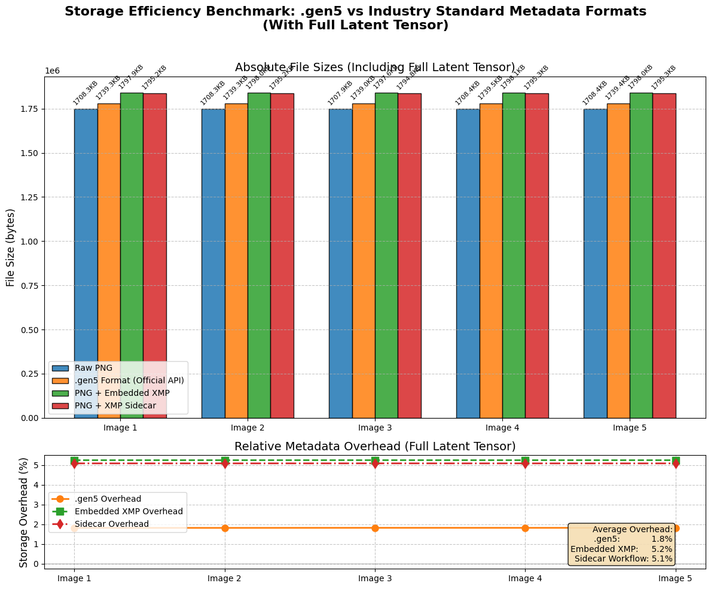

# Summary

'gen5' is an open-source Python package for storing AI-generated images together with their generation context to improve reproducibility. It provides a simple and structured way to persist images and their associated context using a binary container representation.

# Statement of need

Reproducibility in  AI-generated images is an active area of research today, yet apart from a handful of ad-hoc metadata embedding mechanisms, there is a gap for a structured and coupled way of storing and utilising generated context concerning AI-generated images. Although EXIF, XMP, and similar formats allow for the embedding of custom metadata, they fail to consider the context relating to AI-generated images as first-class, validated artifacts. Sidecar files, although suitable for large-scale datasets, introduce unneeded complexity and fragility for small to medium-scale analysis and experimentation, as it requires maintaining separate files and synchronization systems. As a result, critical information such as generation parameters, environment details, and intermediate representations is often fragmented, loosely coupled, or lost altogether. In addition to this, existing standards are not reliable for storing anything more than limited metadata like prompts, model name, etc. This points to a need for a structured and integrated way of dealing with such a context.

The 'gen5' library addresses this gap by providing a simple and structured way of storing and interacting with such context directly alongside the binary of the generated image in a binary container format. This offers a simple solution for experimenters to compare and study generated images.

# State of the field

Concurrent work by [@Gao2024TowardsDA] proposes AIGIF (AI-Generated Image Format), a lightweight container that serializes only the generation syntax, including prompt, seed, model identifier, and inference parameters, and reconstructs the image via re-execution of the generative pipeline. AIGIF achieves extreme compression by forgoing storage of pixels or intermediate representations. In contrast, gen5 adopts a fidelity-first design: it embeds the final image, the initial latent tensor, a structured metadata record, and a cryptographic fingerprint of the runtime environment (PyTorch version, CUDA, OS, and GPU driver). This enables bitwise reproducibility without requiring model availability or re-generation, at the cost of a larger file size. While AIGIF excels in low-bandwidth sharing scenarios where reconstruction is feasible, gen5 targets scientific reproducibility, downstream editing (latent-space manipulation), and forensic traceability. In addition, 'gen5' has explicit storage of latent states and environment hashes, providing stronger guarantees for auditability and analysis. At the time of writing, there is no publicly available, easy-to-use implementation for producing or consuming AIGIF images.

Separately, IPTC has recently proposed separate fields for storing AI-related metadata (i.e, AI System Used, AI System Version Used, AI Prompt Information, and AI Prompt Writer Name) [@iptc2025]. While this improves transparency for editorial and provenance workflows, these fields are not designed to support ML reproducibility. They do not capture critical technical details such as model checkpoint hashes, sampling configurations, seeds/initial noise, or hardware/runtime information, which are required in typical ML pipelines.

Work by [@Guo_2024_CVPR] demonstrates that optimizing the initial noise before sampling leads to images that are more semantically aligned with the input prompt. Importantly, once an optimized noise tensor is obtained, it can be reused to regenerate the same aligned image under deterministic sampling conditions. Thus, storing the optimized initial noise offers a practical mechanism for improving reproducibility and consistency in text-to-image generation, while still benefiting from the alignment gains introduced by INITNO.

A benchmark was performed that involved using the same PNG data for each comparison of relative file size overhead. One full latent tensor per image with shape (1, 4, 64, 64), approximately 88–89 KB, was stored in different methods: 1. with gen5, 2. with PNG and XMP (sidecar), and 3. PNG with embedded XMP. Here, the raw PNG with just the image data is considered the baseline. The reported metric is the relative file size overhead (percentage) compared to the raw PNG: ((size_with_metadata − size_raw_png) / size_raw_png) × 100, where multiplying by 100 converts the fraction to a percentage.
In this benchmark, it was observed that the GEN5 representation introduced only ~1.8% overhead, whereas the sidecar and embedded XMP approaches introduced ~5.1% and ~5.2%, respectively.

| Format | Avg. Size (KB) | Avg. Overhead (%) |
|------|---------------|-------------------|
| Raw PNG | 1708.3 | – |
| GEN5 (.gen5) | 1739.3 | 1.8 |
| PNG + Embedded XMP | 1797.9 | 5.2 |
| PNG + XMP Sidecar | 1795.2 | 5.1 |

A review of current AI-native formats, including AIGIF [@Gao2024TowardsDA], IPTC AI metadata [@iptc2025], and diffusion model checkpoints, reveals no single comprehensive solution that embeds latent states directly alongside the image in a unified container. Gen5 fills this niche by ensuring that all components necessary for analysis, comparison, and reuse remain inseparable during sharing, archiving, or processing.

# Software Design

The gen5 binary container storage solution has been designed with a chunk-based storage method for easy extensibility and usage. The chunk structure is as follows: 
| Chunk Type     | ID (4 bit ASCII) | If Standalone | If Compressed | Structure and Location                                                                 | Additional Notes |
|----------------|-------------------|-------------|-------------|--------------------------------------------------------------------------------------|---------------|
| **Latent**     | `LATN`            |  Yes        | Optional    | Raw/compressed tensor bytes at `offset` in file                                     | Shape stored in metadata `extra` field |
| **Image**      | `DATA`            | Yes         | Yes (PNG)   | PNG bytes at `offset` in file                                                        | Always compressed |
| **Environment**| `ENVC`            | Yes        | Yes (gzip)  | Header (`<4s4sI`) + gzipped JSON at `offset`                                         | Captures runtime env |
| **Metadata**   | `META`            | Yes         | Yes (zstd)  | 12-byte header (`<4s4sI` = `b"META"`, flags, JSON size) + zstd-compressed JSON manifest | Stored at `chunk_table_offset` (from file header)  NOT listed in its own `chunks[]` array |

The environment information has been stored in both metadata and a separate environment chunk. However, only the most essential ones have been included in metadata, which is intended for human preview, and the ones in the environment chunk are for issuing a warning when an environment mismatch is detected. The information in the environment chunkis also hashed canonical strings, which are compared with those of the current environment to determine if there is a potential mismatch.

It also has lazy-loading support, optional float16 conversion, and a hard cap of 100000000 max elements for the latent chunks.

# Research Impact Statement

Gen5 does not bring forth new generative features or experimental methods. Instead, it unifies previously makeshift and unstable practices for documenting latent representations, environmental specifics, and generation metadata into a single, validated binary container format. By considering these elements as integral parts of the image artifact, Gen5 minimizes coordination challenges, prevents unnoticed metadata loss, and enhances the reproducibility and auditability of AI-generated images.

In the short term, its impact is anticipated in studies focused on reproducibility, dataset curation, and forensic examination of AI-generated images. By reducing the practical obstacles to preserving and sharing the complete generation context, Gen5 makes controlled latent reuse, environment comparison, and provenance inspection more dependable and reviewable as part of standard research workflows.

# AI usage disclosure

Generative AI tools were only used in a limited capacity for code review and high-level brainstorming during development. All code, experimental results, and manuscript text were written and validated by the author.

# References
